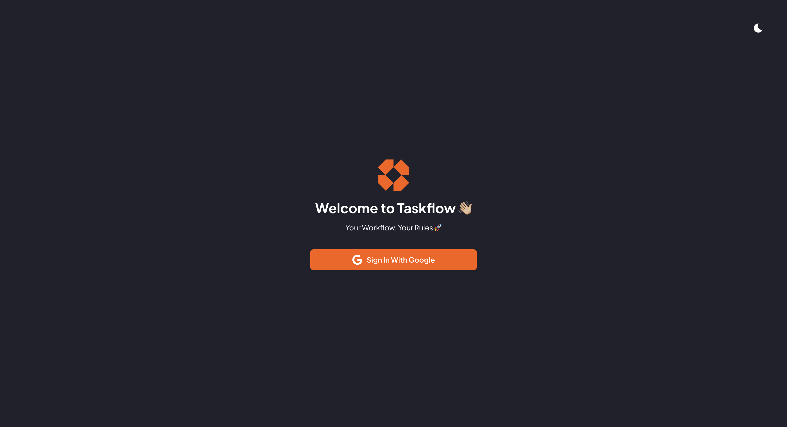

# 🧠 TaskFlow — Visual Task & Project Management

**TaskFlow** is a lightweight, intuitive task management application inspired by Kanban-style workflows. Organize your boards, track tasks, and collaborate — all in a beautiful, responsive interface.

## ✨ Features

- 🧩 **Boards & Columns** — Create unlimited boards with custom columns (e.g., Todo, In Progress, Done)
- ✅ **Drag & Drop Tasks** — Reorder tasks and move them between columns with smooth interaction
- 🔒 **Google Authentication** — Secure login via Firebase Auth
- 📦 **Realtime Sync** — Firestore backend updates tasks and boards in real-time
- 💾 **Persistent State** — Zustand handles local state across components
- 🌙 **Dark/Light Theme Toggle** — Stylish and easy on the eyes
- 📱 **Responsive Design** — Fully mobile, tablet and desktop friendly

---

## 🖼️ Screenshots



<p align='center'>
<a href="https://taaskflow.netlify.app/">Live Demo</a>
</p>

---

## 🔧 Tech Stack

- **Frontend:** React, TypeScript, Tailwind CSS
- **State Management:** Zustand
- **UI Library:** PrimeReact
- **Drag & Drop:** `sortablejs`
- **Auth & Backend:** Firebase (Auth + Firestore)
- **Routing:** React Router v6

---

## 🚀 Getting Started

### 1. Clone the repo

```bash
git clone https://github.com/blade-01/TaskFlow.git
cd taskflow
```
### 2. Install dependencies

```bash
npm install
# or
yarn install
```

### 3. Add firebase config

``` bash
VITE_APP_FIREBASE_API_KEY=YOUR_API_KEY
VITE_APP_FIREBASE_APP_ID=YOUR_APP_ID
```

### 4. Start the development server

``` bash
npm run dev
# or
yarn dev
```

## ✨ Acknowledgement

Alhamdulillah 🤲🏽
